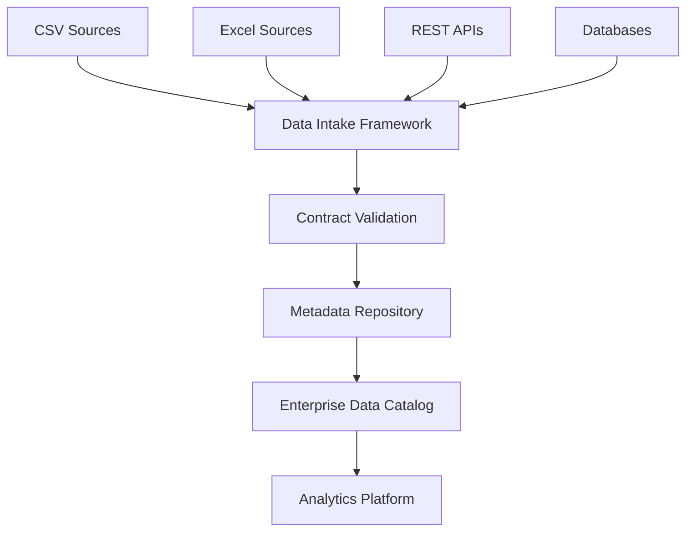

# Future-State Architecture

## Purpose

This diagram illustrates how the framework could evolve from a file-based intake process into a broader enterprise analytics platform.

## Design Goals

- Support multiple source types
- Centralize metadata management
- Improve discoverability through cataloging
- Maintain contract-driven validation
- Enable future cloud-native deployment patterns