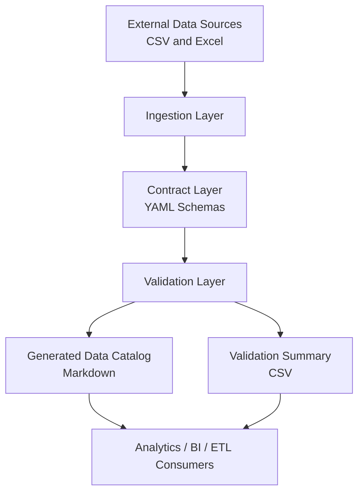

# High-Level Architecture

## Purpose

This diagram shows the framework at a system level, emphasizing architectural layers rather than implementation details.

## Layer Responsibilities

| Layer | Responsibility |
|---|---|
| External Data Sources | Raw source files provided by upstream systems or users |
| Ingestion Layer | Reads supported data formats into standardized structures |
| Contract Layer | Defines expected dataset structure using schema contracts |
| Validation Layer | Compares source data against contracts and reports issues |
| Generated Data Catalog | Provides human-readable metadata for data consumers |
| Validation Summary | Provides machine-readable validation results |
| Analytics / BI / ETL Consumers | Represents downstream reporting, analytics, and pipeline workflows |
