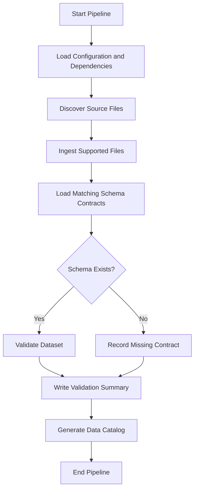

# Processing Flow

## Purpose

This document describes the runtime processing flow for the framework.

## Design Notes

- Source discovery is separated from validation logic.
- Schema existence is treated as an explicit validation condition.
- Validation outputs are generated as reproducible artifacts.
- Documentation generation is part of the pipeline rather than a manual afterthought.
